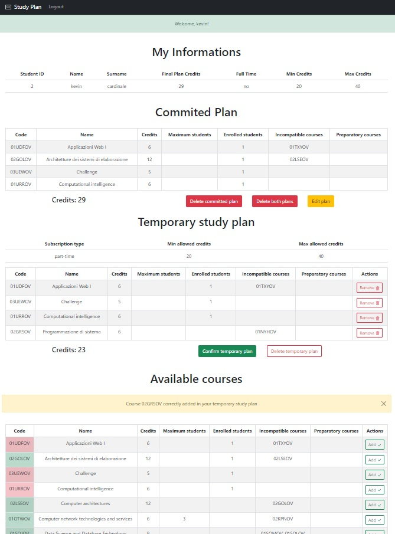

# Exam #00001: "Study plan"
## Student: s305035 CARDINALE KEVIN

## React Client Application Routes

- Route `/`: this page is only used to manualy redirect the user to the `/myplan` if the user is logged in or to the `/main` route if the use is not logged in
- Route `/myplan`: this page has all the functionalities to create a new study plan, view the already committed plan and has also the functionalities to edit a already present study plan.
- Route `/main`: this page is only accessible by unauthenticated users and contains a list of all the courses provided by the system
- Route `/login`: this page is user to make the login
- Route `/*`: default page for not defined resources

## API Server

- PUT `/auth/commitPlan/:id`
  - request parameters and request body content: user id (params), plan (body), subscription type (body), credentials (headers)
  - response body content: possible errors due to validations

- PUT `/auth/deleteCommittedPlan/:id`
  - request parameters and request body content: 
  - response body content: possible errors due to validations

- GET `/unauth/courses`
  - request parameters and request body content: not provided
  - response body content: and array of courses objects

- GET `/auth/getprofile/:id`
  - request parameters and request body content: credentials (headers), id (params)
  - response body content: some user informations

- GET `/api/sessions/current`
  - request parameters and request body content: credentials 
  - response body content: some user informations

- POST `/api/sessions`
  - request parameters and request body content: credentials
  - response body content: some user informations 

- DELETE `/api/sessions/current`
  - request parameters and request body content: credentials 
  - response body content: null

## Database Tables

- Table `users`: table used to store all the information about the user
  - id: student id
  - name: name of the student
  - surname: surname of the student
  - finalPlanCredits: credits of the committed plan
  - finalPlan: committed plan
  - fullTime: _0_ if the student committed a part-time study plan, _1_ if if the student committed a full-time study plan, _null_ if the student hasn't yet committed any study plan
  - email: email of the student
  - salt: salt to generate a crypted password
  - password: crypted password of the student

- Table `courses`: table used to store all the information about the course 
  - code: identifier of the course
  - name: name of the course
  - credits: credits of the course
  - maxStudents: maximum student for the course. _null_ if no limitations.
  - enrolled: number of enrolled student
  - incompatibleWith: list of incompatible courses
  - preparatoryCourse: list of preparatory courses

## Main React Components

- `CourseRow`  (in `CourseRow.js`): this component has all the information and functionalities to handle all the courses. It's adaptable and is used in different situation. 
- `CoursesTable`  (in `CoursesTable.js`): contains all the rows
- `DefaultRoute`  (in `DefaultRoute.js`): component used only to inform the user that a specific route doesn't exist
- `Login`  (in `Login.js`): This component is composed of the form to make the login. It handle the login functionality
- `Logout`  (in `Logout.js`): Button rendered in the navigation bar if and only if the user is logged in. It handle the logout functionality
- `MainPage`  (in `MainPage.js`): contains a row for each course in the system. The rows generated by this component have the possibility to make visible and invisible some information of the course. 
- `MyFinalPlan`  (in `MyFinalPlan.js`): this component contains a table with all the courses joined by the user.
- `MyInformations`  (in `MyInformations.js`): some informations about the user
- `MyProfile`  (in `MyProfile.js`):  it's a sort of container for different components: MyInformations, MyFinalPlan, MyStudyPlan, CoursesTable
- `MyTemporaryStudyPlan`  (in `MyTemporaryStudyPlan.js`): contains a temporary study plan defined by the user. it has all the functionalities to check the compatibility in terms of credits and inconcistencies between different courses.
- `Navigation`  (in `Navigation.js`): no functionalities, only used to provide to the user the possibility to go on the login page or to make the logout

## Screenshot

- Editing session

## Users Credentials

- username: mikeappato@gmail.com, password: ciao1234 
- username: kevincardinale@gmail.com, password: ciao1234 
- username: marcovangelo@gmail.com, password: ciao1234 
- username: zorrospada@gmail.com, password: ciao1234 
- username: luisasal@gmail.com, password: ciao1234 
- username: giuliagiaquinto@gmail.com, password: ciao1234 
